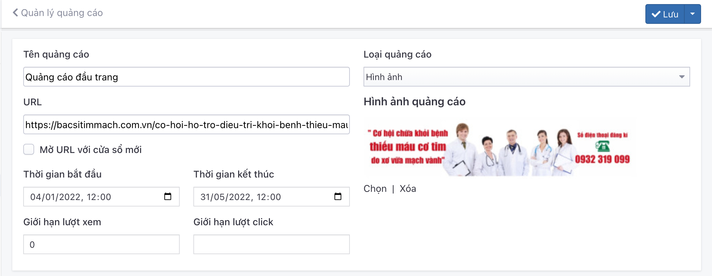
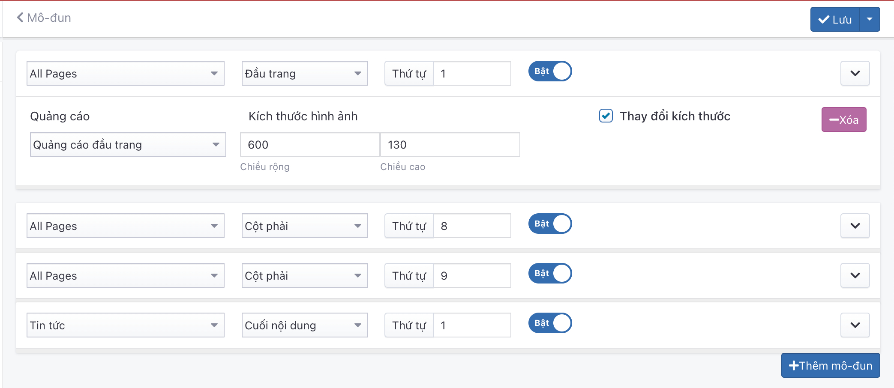

# Quản lý quảng cáo

Cho phép tạo nhiều Quảng cáo tùy theo mục đích.

## Quản lý quảng cáo

### Thêm mới quảng cáo

Để thêm một quảng cáo, bạn cần:

Nhấn chọn **Nội dung -> Quản lý quảng cáo**. Nhấn chọn nút (+) để thêm mới 1 mục.

Những thông tin cụ thể cần điền như sau:

**Banner Quảng cáo**

Nhấn chọn **Chọn** để lựa chọn tập tin hình ảnh của Quảng cáo từ máy tính và tải lên

**Tên quảng cáo**

Nhập tên cho mỗi quảng cáo

**Liên kết**

Nhập đường dẫn liên kết đến website bất kỳ

**Thời gian bắt đầu**

Chọn thời gian bắt đầu của Quảng cáo

**Thời gian kết thúc**

Chọn thời gian kết thúc của Quảng cáo

**Giới hạn lượt xem**

Nhập số lượng giới hạn lượt truy cập quảng cáo

**Loại**

Mặc định là hình ảnh

**Mở liên kết với cửa sổ mới**

Tích checkbox: mở liên kết trong cửa sổ mới
Không tích checkbox: mở liên kết tại cửa sổ hiện tại

Nhấn chọn nút (v) để lưu lại 1 mục.

### Xóa Quảng cáo

Để xóa một banner Quảng cáo, tích vào banner Quảng cáo đó và chọn **Xóa** từ danh sách checkbox bên trái.

Xem thêm [tại đây](https://simplemag.osd.vn/docs/common/logic#x%C3%B3a-c%C3%A1c-m%E1%BB%A5c-c%C3%A1c-th%C3%A0nh-ph%E1%BA%A7n-th%C3%B4ng-tin)

### Sửa Quảng cáo

Để sửa một banner Quảng cáo, nhấn chọn vào banner Quảng cáo đó để sửa.

Sau khi thay đổi các thông tin nội dung của banner Quảng cáo, nhấn chọn nút (v) để cập nhật những thay đổi.

## Cấu hình mô đun Quảng cáo

Nhấn chọn **Giao diện -> Mô đun -> Quảng cáo -> Cấu hình**. Nhấn chọn nút (+) để thêm mới 1 mục.

Những thông tin cấu hình như sau:

**Bố cục/Vị trí**

Xem thêm [tại đây](https://simplemag.osd.vn/docs/common/logic#b%E1%BB%91-c%E1%BB%A5c-v%C3%A0-v%E1%BB%8B-tr%C3%AD)

**Thứ tự**

Xem thêm [tại đây](https://simplemag.osd.vn/docs/common/logic/#th%E1%BB%A9-t%E1%BB%B1-s%E1%BA%AFp-x%E1%BA%BFp-l%C3%A0-s%E1%BB%91-ch%E1%BB%89-%C4%91%E1%BB%8Bnh)

**Trạng thái**

Xem thêm [tại đây](https://simplemag.osd.vn/docs/common/logic/#tr%E1%BA%A1ng-th%C3%A1i)

**Quảng cáo**

Lựa chọn banner Quảng cáo hiển thị

**Kích thước hình ảnh**

Nhập kích thước chiều rộng/Chiều cao tương ứng với mỗi hình ảnh của banner quảng cáo

Sau khi thay đổi các thông tin nội dung của banner Quảng cáo, nhấn chọn nút (v) để cập nhật những thay đổi.