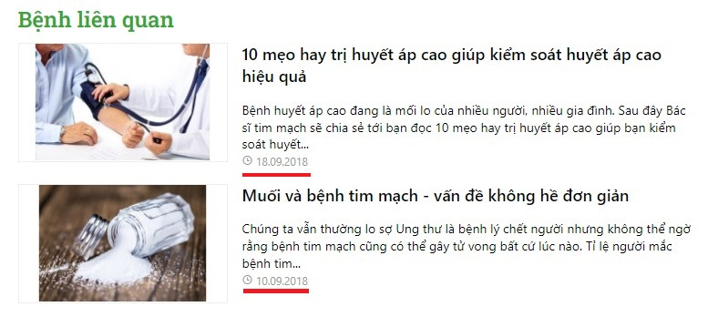
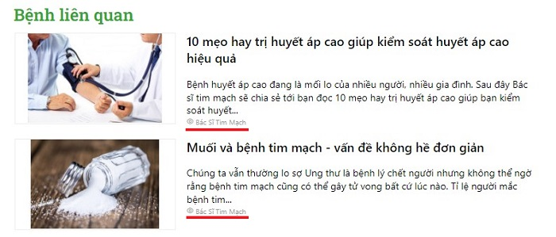
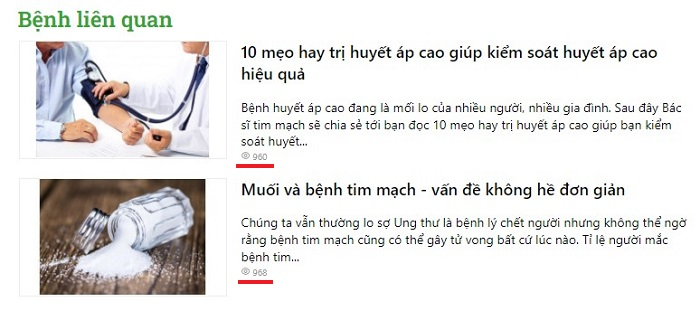

# Chuyên mục tin bài

- Chuyên mục tin bài: cho phép tạo nhiều nhóm những chuyên mục cùng loại với nhau tùy theo mục đích.
- Một chuyên mục tin bài có liên kết mật thiết chặt chẽ với các tin bài cùng loại.
- Hướng dẫn sử dụng tính năng trình soạn thảo: xem thêm [tại đây](https://simplemag.osd.vn/docs/common/tinymce)
- Hướng dẫn sử dụng trình quản lý file: xem thêm [tại đây](https://simplemag.osd.vn/docs/common/finder/)

## Thêm chuyên mục tin bài

Nhấn chọn **Nội dung -> Nhóm và dịch vụ -> Chuyên mục tin**. Nhấn chọn nút (+) để thêm mới 1 mục.

Những thông tin cụ thể cần điền như sau:

*Chú ý: Bạn bắt buộc phải nhập tên nhóm Chuyên mục trước khi có thể lưu lại thông tin.*

**Tên chuyên mục**

Mỗi nhóm chuyên mục tin được tạo sẽ có 1 đường dẫn địa chỉ website, tại URL đó sẽ hiển thị những tin bài mà bạn đã thêm vào

**Mô tả**

Nhập nội dung mô tả chuyên mục tin bài

**Chọn ảnh đại diện**:

Nhấn chọn **Chọn ảnh đại diện**, sau đó chọn thư mục ảnh tương ứng để upload ảnh lên trình quản lý file.

**Cấp cha**:

Chọn danh mục cấp cha cho danh mục này nếu danh mục này không có danh mục cha thì sẽ là danh mục lớn nhất. Bạn nhập tên nhóm chuyên mục tin, hệ thống gợi ý tên danh mục để bạn lựa chọn

**Hiện ngày đăng**

Tích vào trường thông tin này, khi xem ngoài website tại Chuyên mục tin này hệ thống sẽ lấy thông tin ngày đăng tin bài hiển thị dưới tiêu đề tin bài

**Hiện tác giả**

Tích vào trường thông tin này, khi xem ngoài website tại Chuyên mục tin này hệ thống sẽ lấy thông tin tác giả đăng tin bài đó và được hiển thị dưới tiêu đề tin bài

**Hiện lượt xem**

Tích vào trường thông tin này, khi xem ngoài website tại Chuyên mục tin này hệ thống sẽ tất cả lượt xem của tin bài và được hiển thị dưới tiêu đề tin bài

**Giao diện**

- **Mặc định**: hiển thị các bài tin theo hàng dọc bao gồm ảnh đại diện, tiêu đề và mô tả ngắn bài tin

**Thứ tự**

Xem thêm [tại đây](https://simplemag.osd.vn/docs/common/logic/#th%E1%BB%A9-t%E1%BB%B1-s%E1%BA%AFp-x%E1%BA%BFp-l%C3%A0-s%E1%BB%91-ch%E1%BB%89-%C4%91%E1%BB%8Bnh)

**Trạng thái**

Xem thêm [tại đây](https://simplemag.osd.vn/docs/common/logic/#tr%E1%BA%A1ng-th%C3%A1i)

_Chỉnh sửa SEO để tối ưu trên các công cụ tìm kiếm bao gồm Meta title, Meta keyword, Meta Description_

Nhấn chọn icon bút chì để sửa các trường _Meta title, Meta keyword, Meta Description_

Xem [tại đây](https://simplemag.osd.vn/docs/seo/serp/)

Nhấn chọn nút (v) để lưu lại 1 mục.

## Xóa nhóm chuyên mục tin bài

Chọn **Xóa** từ danh sách checkbox bên trái hoặc nhấn chọn nút **Xóa chuyên mục** trong mỗi chuyên mục tin bài chi tiết.

Xem thêm [tại đây](https://simplemag.osd.vn/docs/common/logic#x%C3%B3a-c%C3%A1c-m%E1%BB%A5c-c%C3%A1c-th%C3%A0nh-ph%E1%BA%A7n-th%C3%B4ng-tin)

## Sửa nhóm chuyên mục tin bài

Nhấp chọn trực tiếp vào nhóm chuyên mục tin bài cần sửa hoặc nhấn vào icon bút chì.

Sau khi thay đổi các thông tin nội dung của bài viết cần chọn nút (v) để cập nhật những thay đổi.
