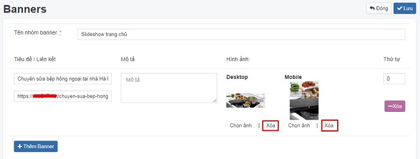
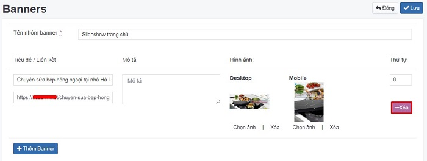
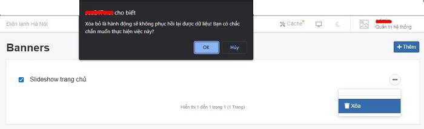

# Banner và trình diễn banner

Là công cụ trình chiếu gồm 1 chuỗi những hình ảnh.

**Một số lưu ý về slideshow và banner**

Đối với thiết lập banner (thêm mới banner), bạn cần cấu hình [tại đây](https://simplemag.osd.vn/docs/design/module/slideshow), để hiển thị ngoài trang chủ website.

## Quản lý Banner

### Thêm mới banner

Tại đây bạn có thể quản lý các banner đã tạo. Để thêm một nhóm sản phẩm, bạn cần:

Nhấn chọn **Giao diện -> Banner**. Nhấn chọn nút (+) để thêm mới 1 mục.

Những thông tin cụ thể cần điền như sau:

**Tên nhóm banner**

Nhập tên nhóm banner tương ứng để quản lý nhóm banner theo logic

**Tiêu đề/Mô tả**

Nhập tên tiêu đề/mô tả mỗi banner muốn hiển thị trên ảnh banner đó

**Link**

Dán liên kết tại đây. Khi xem ngoài website và click vào ảnh hệ thống sẽ chuyển hướng tới liên kết này.

**Desktop/Mobile**

Upload ảnh banner theo kích thước desktop/mobile

**Thứ tự**

Xem thêm [tại đây](https://simplemag.osd.vn/docs/common/logic/#th%E1%BB%A9-t%E1%BB%B1-s%E1%BA%AFp-x%E1%BA%BFp-l%C3%A0-s%E1%BB%91-ch%E1%BB%89-%C4%91%E1%BB%8Bnh)

**Trạng thái**

Xem thêm [tại đây](https://simplemag.osd.vn/docs/common/logic/#tr%E1%BA%A1ng-th%C3%A1i)

**Thêm banner**

Nhấn chọn để thêm nhiều banner khác nhau

Nhấn chọn nút (v) để lưu lại 1 mục.

### Xóa một nhóm banner

Để xóa một ảnh trong nhóm banner, nhấn nút **Xóa** ảnh tại ảnh banner đó.

Để xóa toàn bộ một ảnh, nội dung và liên kết của banner trong nhóm banner, nhấn nút **Xóa** tại ảnh banner đó.

Hoặc để xóa một nhóm banner, nhấp chuột vào nút 3 chấm cuối nhóm banner và chọn nút **Xóa**.

Xem thêm [tại đây](https://simplemag.osd.vn/docs/common/logic#x%C3%B3a-c%C3%A1c-m%E1%BB%A5c-c%C3%A1c-th%C3%A0nh-ph%E1%BA%A7n-th%C3%B4ng-tin)

### Sửa một nhóm banner

Để thay đổi thông tin các trường trong nhóm banner, bạn chọn nhấn chọn trực tiếp tại nhóm banner.

Để sửa một ảnh trong nhóm banner, nhấn **Chọn ảnh** để tải lại ảnh tại nhóm banner đó

Sau khi thay đổi các thông tin nội dung của banner bạn cần chọn nút **v** để hoàn tất.

