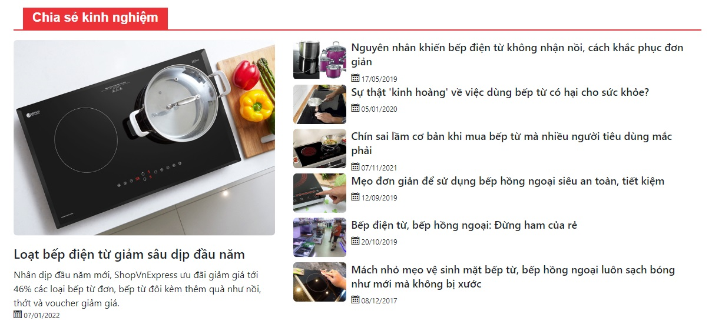
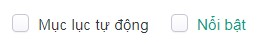

# Mô đun trình bày tin bài

Cho phép cấu hình chuyên mục tin bài tại nhiều bố cục và vị trí khác nhau trên website.

## Thêm cấu hình trình bày tin bài

Để cấu hình mô đun trình bày tin bài, bạn cần:

Nhấn chọn **Giao diện -> Mô đun -> Trình bày tib bài -> Cấu hình -> Thêm mô đun**. Những thông tin cụ thể cần điền như sau:

**Bố cục/Vị trí**

Xem thêm [tại đây](https://simplemag.osd.vn/docs/common/logic#b%E1%BB%91-c%E1%BB%A5c-v%C3%A0-v%E1%BB%8B-tr%C3%AD)

**Thứ tự**

Xem thêm [tại đây](https://simplemag.osd.vn/docs/common/logic/#th%E1%BB%A9-t%E1%BB%B1-s%E1%BA%AFp-x%E1%BA%BFp-l%C3%A0-s%E1%BB%91-ch%E1%BB%89-%C4%91%E1%BB%8Bnh)

**Trạng thái**

Xem thêm [tại đây](https://simplemag.osd.vn/docs/common/logic#tr%E1%BA%A1ng-th%C3%A1i-v%C3%A0-xu%E1%BA%A5t-b%E1%BA%A3n)

**Hiện tiêu đề**

- Hiện tiêu đề mô đun: cho phép hiển thị tiêu đề của chuyên mục
- Ẩn tiêu đề mô đun: không cho phép hiển thị tiêu đề của chuyên mục

**Chuyên mục**

Chọn chuyên mục muốn hiển thị trên website

**Mẫu trình bày**

Lựa chọn mẫu trình bày có sẵn tại danh sách thả xuống

**Hiện ảnh/Lượt xem/Sapo/Ngày đăng**

Tích chọn, để hiện các tùy chọn trên tại mỗi nhóm chuyên mục được chọn của mô đun này khi xem trên website

**Giới hạn**

Nhập giới hạn số bài hiển thị số tin bài trong nhóm chuyên mục khi xem trên website

**Tin nhấn mạnh**: nhập số tin cần nhấn mạnh. Với 1 tin nhấn mạnh được hiển thị như sau:

**Khổ ảnh**

**Tỷ lệ**

**Sắp xếp theo**

Lựa chọn kiểu sắp xếp tại danh sách thả xuống

- **Lượt xem**: hiển thị sắp xếp ưu tiên theo lượt xem của bài tin
- **Thứ tự**: hiển thị sắp xếp ưu tiên theo thứ tự của mỗi bài tin
- **Nổi bật**: hiển thị các bài tin được tích vào trường Nổi bật. (Trong mỗi bài tin bạn cần tích vào trường nổi bật để hiển thị theo sắp xếp này)

- **Ngày đăng**: hiển thị ưu tiên theo ngày đăng của bài tin

**Kiểu sắp xếp**

Lựa chọn kiểu sắp xếp tại danh sách thả xuống

**Thêm mô đun**

Có thể thêm nhiều mô đun tại bố cục và vị trí khác nhau trên website

Nhấn chọn nút **Lưu** để lưu lại 1 mục.

## Xóa cấu hình trình bày tin bài

Nhấn chọn **Xóa** để xóa mô đun này.

Xem thêm [tại đây](https://simplemag.osd.vn/docs/common/logic#x%C3%B3a-c%C3%A1c-m%E1%BB%A5c-c%C3%A1c-th%C3%A0nh-ph%E1%BA%A7n-th%C3%B4ng-tin)

## Sửa cấu hình trình bày tin bài

Nhấn chọn **Cấu hình** tại mô đun **Trình bày tin bài**

Sau khi thay đổi các thông tin - thiết lập của mô đun cần chọn nút **Lưu** để hoàn tất.
