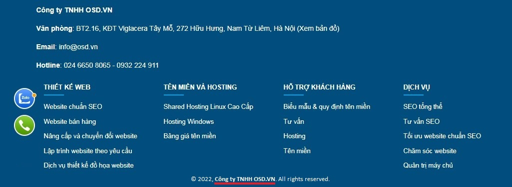

# Thiết lập hệ thống

Khu vực cấu hình các tham số chung liên quan đến website và doanh nghiệp của bạn. Những thông tin cần điền như sau:

## Thông tin chung

**Tên website**

Nhập tên thường gọi của website. Được hiển thị tại các trang trên website _(ví dụ: OSD.VN)_

**Chủ sở hữu**

Nhập tên cá nhân/ công ty chủ sở hữu website, trường này sẽ hiển thị cuối trang website như hình đính kèm bên dưới _(ví dụ: Công ty TNHH OSD.VN)_

**Địa chỉ**
Thông tin này thường xuất hiện tại chân trang, trang thông tin liên hệ.

**E-mail**

Địa chỉ email dùng để nhận thông tin giao tiếp với người sử dụng (bao gồm form liên hệ, các form khác trên website). Khi có nhiều email, cần ngăn cách bằng dấu chấm phẩy. Ví dụ: info@osd.vn; system@osd.vn.

**Điện thoại**

Sẽ hiển thị tại chân trang và trang liên hệ.

**Hotline bán hàng/Hotline hỗ trợ**

Hiển thị số hotline bán hàng của công ty/văn phòng trên trang liên hệ của website, nhằm người dùng có thể liên hệ với công ty/văn phòng để được tư vấn và sử dụng dịch vụ.

## Địa phương

**Ngôn ngữ chính**

Mặc định là Việt Nam

## Bảo mật hệ thống

**Chế độ bảo trì** Khi chọn là **Bật** hệ thống hiển thị 1 thông báo website ở chế độ bảo trì, không xem được các thông tin đang có trên website. Người dùng quản trị (admin) sau khi đăng nhập, xem website hoạt động như bình thường.

Nhấn chọn nút **v** để hoàn tất.